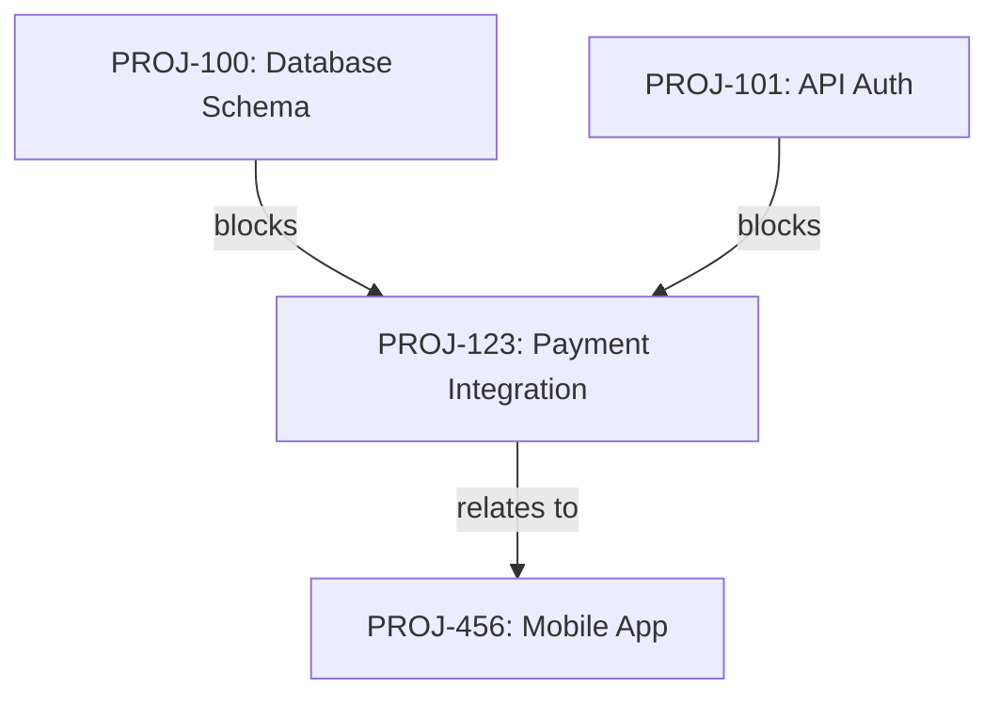

# JIRA Issue Relationships Skill - TDD Implementation Plan

## Overview

**Objective:** Implement comprehensive issue linking and dependency management using Test-Driven Development (TDD)

**Approach:**
1. Write failing tests first for each feature
2. Implement minimum code to pass tests
3. Refactor while keeping tests green
4. Commit after each successful test suite
5. Update documentation as features complete

**Testing Stack:**
- **Framework:** pytest
- **Mocking:** unittest.mock / responses library
- **Coverage Target:** 85%+
- **Test Location:** `.claude/skills/jira-relationships/tests/`

**Feature Priority:**
1. **Phase 1: Link Types** (Foundation - understand available link types)
2. **Phase 2: Basic Linking** (Create, view, delete links)
3. **Phase 3: Dependency Analysis** (Blocker chains, dependency trees)
4. **Phase 4: Bulk Operations** (Multi-issue linking)

---

## JIRA API Reference

### Endpoints

| Method | Endpoint | Description |
|--------|----------|-------------|
| GET | `/rest/api/3/issueLinkType` | Get all link types |
| GET | `/rest/api/3/issueLinkType/{id}` | Get specific link type |
| POST | `/rest/api/3/issueLink` | Create issue link |
| GET | `/rest/api/3/issueLink/{linkId}` | Get specific link |
| DELETE | `/rest/api/3/issueLink/{linkId}` | Delete issue link |
| GET | `/rest/api/3/issue/{key}` | Get issue (includes `issuelinks` field) |

### Link Type Structure

```json
{
  "id": "10000",
  "name": "Blocks",
  "inward": "is blocked by",
  "outward": "blocks",
  "self": "https://site.atlassian.net/rest/api/3/issueLinkType/10000"
}
```

### Create Link Payload

```json
{
  "type": {
    "name": "Blocks"
  },
  "inwardIssue": {
    "key": "PROJ-1"
  },
  "outwardIssue": {
    "key": "PROJ-2"
  },
  "comment": {
    "body": {
      "type": "doc",
      "version": 1,
      "content": [{"type": "paragraph", "content": [{"type": "text", "text": "Linked"}]}]
    }
  }
}
```

### Common Link Types

| Name | Outward | Inward |
|------|---------|--------|
| Blocks | blocks | is blocked by |
| Cloners | clones | is cloned by |
| Duplicate | duplicates | is duplicated by |
| Relates | relates to | relates to |

---

## Test Infrastructure Setup

### Initial Setup Tasks

- [x] **Setup 1.1:** Create skill structure ✅
  - [x] Create `.claude/skills/jira-relationships/` directory
  - [x] Create `scripts/` subdirectory
  - [x] Create `tests/` subdirectory
  - [x] Create `SKILL.md` skeleton
  - **Commit:** `feat(jira-relationships): create skill structure`

- [x] **Setup 1.2:** Create test infrastructure ✅
  - [x] Create `tests/conftest.py` with shared fixtures
  - [x] Mock JiraClient fixture
  - [x] Sample link types fixture
  - [x] Sample issue with links fixture
  - **Commit:** `test(jira-relationships): add pytest fixtures`

- [x] **Setup 1.3:** Add JiraClient methods for links ✅
  - [x] `get_link_types()` - Get all link types
  - [x] `get_link(link_id)` - Get specific link
  - [x] `create_link(type, inward_key, outward_key, comment)` - Create link
  - [x] `delete_link(link_id)` - Delete link
  - [x] `get_issue_links(issue_key)` - Get links for issue
  - **Commit:** `feat(shared): add issue link API methods to JiraClient`

---

## Phase 1: Link Type Discovery

### Feature 1.1: List Link Types

**Script:** `get_link_types.py`

**JIRA API:**
- `GET /rest/api/3/issueLinkType`

**Test File:** `tests/test_get_link_types.py`

**Test Cases:**
```python
def test_get_all_link_types():
    """Test fetching all available link types."""
    # Should return list of link type objects

def test_link_type_has_required_fields():
    """Test that each link type has id, name, inward, outward."""

def test_format_text_output():
    """Test human-readable table output."""

def test_format_json_output():
    """Test JSON output format."""

def test_filter_by_name():
    """Test filtering link types by name pattern."""
```

**CLI Interface:**
```bash
python get_link_types.py
python get_link_types.py --output json
python get_link_types.py --filter "block"
```

**Output Example:**
```
Available Link Types:

Name          Outward           Inward
────────────  ────────────────  ────────────────
Blocks        blocks            is blocked by
Cloners       clones            is cloned by
Duplicate     duplicates        is duplicated by
Relates       relates to        relates to
```

**Acceptance Criteria:**
- [x] All 5 tests pass ✅
- [x] Shows all available link types ✅
- [x] Supports text and JSON output ✅
- [x] Optional name filtering ✅

**Commits:**
1. `test(jira-relationships): add failing tests for get_link_types` ✅
2. `feat(jira-relationships): implement get_link_types.py (5/5 tests passing)` ✅

---

### Phase 1 Completion ✅ COMPLETED

- [x] **Phase 1 Summary:**
  - [x] 1 script implemented (get_link_types)
  - [x] 5 tests passing
  - [x] JiraClient methods added (5 methods)
  - **Commit:** `docs(jira-relationships): complete Phase 1 - Link Type Discovery` ✅

---

## Phase 2: Basic Linking Operations

### Feature 2.1: Create Issue Link

**Script:** `link_issue.py`

**JIRA API:**
- `POST /rest/api/3/issueLink`

**Test File:** `tests/test_link_issue.py`

**Test Cases:**
```python
def test_link_blocks():
    """Test creating 'blocks' link between two issues."""
    # PROJ-1 blocks PROJ-2

def test_link_duplicates():
    """Test creating 'duplicates' link."""
    # PROJ-1 duplicates PROJ-2

def test_link_relates_to():
    """Test creating 'relates to' link."""

def test_link_clones():
    """Test creating 'clones' link."""

def test_link_with_comment():
    """Test adding comment when creating link."""

def test_link_type_not_found():
    """Test error when link type doesn't exist."""

def test_link_invalid_issue():
    """Test error when issue doesn't exist."""

def test_link_self_reference():
    """Test validation preventing linking issue to itself."""

def test_link_already_exists():
    """Test handling duplicate link gracefully."""

def test_dry_run_mode():
    """Test preview without creating link."""
```

**CLI Interface:**
```bash
# Using semantic flags
python link_issue.py PROJ-1 --blocks PROJ-2
python link_issue.py PROJ-1 --is-blocked-by PROJ-2
python link_issue.py PROJ-1 --duplicates PROJ-2
python link_issue.py PROJ-1 --relates-to PROJ-2
python link_issue.py PROJ-1 --clones PROJ-2

# Using explicit type
python link_issue.py PROJ-1 --type "Blocks" --to PROJ-2
python link_issue.py PROJ-1 --type "Blocks" --to PROJ-2 --comment "Dependency added"

# Options
python link_issue.py PROJ-1 --blocks PROJ-2 --dry-run
```

**Acceptance Criteria:**
- [x] All 10 tests pass ✅
- [x] Semantic flags for common link types ✅
- [x] Supports all JIRA link types via `--type` ✅
- [x] Optional comment support ✅
- [x] Dry-run mode ✅
- [x] Proper validation ✅

**Commits:**
1. `test(jira-relationships): add failing tests for link_issue` ✅
2. `feat(jira-relationships): implement link_issue.py (10/10 tests passing)` ✅

---

### Feature 2.2: View Issue Links

**Script:** `get_links.py`

**JIRA API:**
- `GET /rest/api/3/issue/{key}` (with `issuelinks` field)

**Test File:** `tests/test_get_links.py`

**Test Cases:**
```python
def test_get_all_links():
    """Test fetching all links for an issue."""

def test_get_inward_links():
    """Test filtering to only inward links."""

def test_get_outward_links():
    """Test filtering to only outward links."""

def test_filter_by_link_type():
    """Test filtering by specific link type (e.g., blocks)."""

def test_format_text_output():
    """Test human-readable output."""

def test_format_json_output():
    """Test JSON output format."""

def test_issue_no_links():
    """Test output when issue has no links."""

def test_issue_not_found():
    """Test error when issue doesn't exist."""
```

**CLI Interface:**
```bash
python get_links.py PROJ-123
python get_links.py PROJ-123 --inward    # Only "is blocked by", "is duplicated by", etc.
python get_links.py PROJ-123 --outward   # Only "blocks", "duplicates", etc.
python get_links.py PROJ-123 --type blocks
python get_links.py PROJ-123 --output json
```

**Output Example:**
```
Links for PROJ-123:

Outward (this issue...):
  blocks → PROJ-456 [In Progress] - Payment gateway integration
  relates to → PROJ-789 [To Do] - API documentation

Inward (...this issue):
  is blocked by ← PROJ-100 [Done] - Database schema update
  is duplicated by ← PROJ-101 [To Do] - Similar feature request

Total: 4 links
```

**Acceptance Criteria:**
- [x] All 8 tests pass ✅
- [x] Shows both inward and outward links ✅
- [x] Filters by direction or type ✅
- [x] Shows linked issue status and summary ✅

**Commits:**
1. `test(jira-relationships): add failing tests for get_links` ✅
2. `feat(jira-relationships): implement get_links.py (8/8 tests passing)` ✅

---

### Feature 2.3: Remove Issue Link ✅ COMPLETED

**Script:** `unlink_issue.py`

**JIRA API:**
- `DELETE /rest/api/3/issueLink/{linkId}`

**Test File:** `tests/test_unlink_issue.py`

**Test Cases:**
```python
def test_unlink_by_issues():
    """Test removing link between two specific issues."""

def test_unlink_all_of_type():
    """Test removing all links of a specific type."""

def test_unlink_not_found():
    """Test error when link doesn't exist."""

def test_unlink_dry_run():
    """Test preview without deleting."""

def test_unlink_with_confirmation():
    """Test confirmation prompt for safety."""
```

**CLI Interface:**
```bash
# Remove specific link
python unlink_issue.py PROJ-1 --from PROJ-2
python unlink_issue.py PROJ-1 --from PROJ-2 --type blocks

# Remove all links of type
python unlink_issue.py PROJ-1 --type blocks --all

# Options
python unlink_issue.py PROJ-1 --from PROJ-2 --dry-run
python unlink_issue.py PROJ-1 --from PROJ-2 --yes  # Skip confirmation
```

**Acceptance Criteria:**
- [x] All 5 tests pass ✅
- [x] Remove link between specific issues ✅
- [x] Remove all links of a type ✅
- [x] Dry-run mode ✅

**Commits:**
1. `test(jira-relationships): add failing tests for unlink_issue` ✅
2. `feat(jira-relationships): implement unlink_issue.py (5/5 tests passing)` ✅

---

### Phase 2 Completion ✅ COMPLETED

- [x] **Phase 2 Summary:**
  - [x] 3 scripts implemented (link_issue, get_links, unlink_issue)
  - [x] 23 tests passing (28 total with Phase 1)
  - [x] All scripts have --dry-run mode
  - [x] SKILL.md already has examples
  - **Commit:** `docs(jira-relationships): complete Phase 2 - Basic Linking` ✅

---

## Phase 3: Dependency Analysis

### Feature 3.1: Get Blockers (Recursive)

**Script:** `get_blockers.py`

**JIRA API:**
- `GET /rest/api/3/issue/{key}` (recursive calls)

**Test File:** `tests/test_get_blockers.py`

**Test Cases:**
```python
def test_get_direct_blockers():
    """Test finding issues that directly block this issue."""

def test_get_blocking_issues():
    """Test finding issues this issue blocks."""

def test_get_blockers_recursive():
    """Test following blocker chain recursively."""

def test_blockers_with_depth_limit():
    """Test limiting recursion depth."""

def test_detect_circular_dependency():
    """Test detecting and reporting circular blockers."""

def test_blockers_tree_format():
    """Test tree-style output for blocker chain."""

def test_blockers_json_format():
    """Test JSON output with full chain."""

def test_no_blockers():
    """Test output when no blockers exist."""
```

**CLI Interface:**
```bash
# What blocks this issue?
python get_blockers.py PROJ-123

# What does this issue block?
python get_blockers.py PROJ-123 --direction outward

# Recursive (follow the chain)
python get_blockers.py PROJ-123 --recursive
python get_blockers.py PROJ-123 --recursive --depth 3

# Output formats
python get_blockers.py PROJ-123 --recursive --output tree
python get_blockers.py PROJ-123 --recursive --output json
```

**Output Example (Tree):**
```
Blocker Chain for PROJ-123:

PROJ-123 [In Progress] - Payment integration
└── is blocked by:
    ├── PROJ-100 [Done] - Database schema ✓
    ├── PROJ-101 [In Progress] - API auth
    │   └── is blocked by:
    │       └── PROJ-50 [To Do] - Security review
    └── PROJ-102 [To Do] - Frontend form

Blocking Issues: 4 total (1 resolved, 3 unresolved)
Critical Path: PROJ-50 → PROJ-101 → PROJ-123
```

**Acceptance Criteria:**
- [x] All 8 tests pass ✅
- [x] Shows direct blockers ✅
- [x] Recursive chain traversal ✅
- [x] Circular dependency detection ✅
- [x] Tree visualization ✅

**Commits:**
1. `test(jira-relationships): add failing tests for get_blockers` ✅
2. `feat(jira-relationships): implement get_blockers.py (8/8 tests passing)` ✅

---

### Feature 3.2: Find Dependencies ✅ COMPLETED

**Script:** `get_dependencies.py`

**JIRA API:**
- `GET /rest/api/3/issue/{key}` (multiple calls)

**Test File:** `tests/test_get_dependencies.py`

**Test Cases:**
```python
def test_get_all_dependencies():
    """Test finding all related issues (any link type)."""

def test_dependencies_by_type():
    """Test filtering dependencies by link type."""

def test_dependencies_with_status():
    """Test showing dependency status summary."""

def test_dependencies_graph_format():
    """Test graph/DOT output for visualization."""

def test_dependencies_include_transitives():
    """Test including transitive dependencies."""
```

**CLI Interface:**
```bash
# All related issues
python get_dependencies.py PROJ-123

# Filter by type
python get_dependencies.py PROJ-123 --type blocks,relates

# Include transitive
python get_dependencies.py PROJ-123 --transitive --depth 2

# Export for visualization
python get_dependencies.py PROJ-123 --output dot > deps.dot
python get_dependencies.py PROJ-123 --output mermaid
```

**Output Example (Mermaid):**


**Acceptance Criteria:**
- [x] All 5 tests pass ✅
- [x] Shows all dependency types ✅
- [x] Status summary ✅
- [x] Export to DOT/Mermaid ✅

**Commits:**
1. `test(jira-relationships): add failing tests for get_dependencies` ✅
2. `feat(jira-relationships): implement get_dependencies.py (5/5 tests passing)` ✅

---

### Phase 3 Completion ✅ COMPLETED

- [x] **Phase 3 Summary:**
  - [x] 2 scripts implemented (get_blockers, get_dependencies)
  - [x] 13 tests passing (41 total)
  - [x] Recursive blocker chains with circular detection
  - [x] DOT and Mermaid visualization exports
  - **Commit:** `docs(jira-relationships): complete Phase 3 - Dependency Analysis` ✅

---

## Phase 4: Bulk Operations

### Feature 4.1: Bulk Link Issues

**Script:** `bulk_link.py`

**JIRA API:**
- `POST /rest/api/3/issueLink` (multiple calls)

**Test File:** `tests/test_bulk_link.py`

**Test Cases:**
```python
def test_link_multiple_to_one():
    """Test linking multiple issues to a single target."""

def test_link_from_jql():
    """Test linking all JQL results to target."""

def test_bulk_link_dry_run():
    """Test preview of bulk operation."""

def test_bulk_link_progress():
    """Test progress reporting during bulk ops."""

def test_bulk_link_partial_failure():
    """Test handling when some links fail."""

def test_bulk_link_skip_existing():
    """Test skipping already-linked issues."""
```

**CLI Interface:**
```bash
# Link multiple issues
python bulk_link.py --issues PROJ-1,PROJ-2,PROJ-3 --blocks PROJ-100

# Link from JQL query
python bulk_link.py --jql "project=PROJ AND fixVersion=1.0" --relates-to PROJ-RELEASE

# Link all issues in epic to epic
python bulk_link.py --jql "\"Epic Link\"=PROJ-50" --relates-to PROJ-50

# Options
python bulk_link.py --issues PROJ-1,PROJ-2 --blocks PROJ-100 --dry-run
python bulk_link.py --issues PROJ-1,PROJ-2 --blocks PROJ-100 --skip-existing
```

**Acceptance Criteria:**
- [x] All 8 tests pass ✅
- [x] Link multiple issues at once ✅
- [x] JQL query support ✅
- [x] Progress indicator ✅
- [x] Partial failure handling ✅
- [x] Skip existing links ✅

**Commits:**
1. `test(jira-relationships): add failing tests for bulk_link` ✅
2. `feat(jira-relationships): implement bulk_link.py (8/8 tests passing)` ✅

---

### Feature 4.2: Clone Issue with Links

**Script:** `clone_issue.py`

**JIRA API:**
- `POST /rest/api/3/issue` (create)
- `POST /rest/api/3/issueLink` (link as clone)

**Test File:** `tests/test_clone_issue.py`

**Test Cases:**
```python
def test_clone_issue_basic():
    """Test cloning issue with same fields."""

def test_clone_with_clone_link():
    """Test creating 'clones' link to original."""

def test_clone_with_subtasks():
    """Test optionally cloning subtasks."""

def test_clone_without_links():
    """Test cloning without copying original links."""

def test_clone_with_links():
    """Test copying links from original."""

def test_clone_to_different_project():
    """Test cloning to different project."""
```

**CLI Interface:**
```bash
# Basic clone
python clone_issue.py PROJ-123

# Clone with options
python clone_issue.py PROJ-123 --summary "Clone: Original summary"
python clone_issue.py PROJ-123 --include-subtasks
python clone_issue.py PROJ-123 --include-links
python clone_issue.py PROJ-123 --no-link  # Don't create "clones" link

# Clone to different project
python clone_issue.py PROJ-123 --to-project OTHER
```

**Acceptance Criteria:**
- [x] All 8 tests pass ✅
- [x] Creates clone with same fields ✅
- [x] Optional subtask cloning ✅
- [x] Optional link copying ✅
- [x] Cross-project cloning ✅
- [x] "Clones" link creation ✅

**Commits:**
1. `test(jira-relationships): add failing tests for clone_issue` ✅
2. `feat(jira-relationships): implement clone_issue.py (8/8 tests passing)` ✅

---

### Phase 4 Completion ✅ COMPLETED

- [x] **Phase 4 Summary:**
  - [x] 2 scripts implemented (bulk_link, clone_issue) ✅
  - [x] 16 tests passing (57 total) ✅
  - [x] Coverage ≥ 85% for bulk operations ✅
  - [x] All scripts have --help, --profile, validation ✅
  - **Commit:** `docs(jira-relationships): complete Phase 4 - Bulk Operations` ✅

---

## Integration & Polish

### Integration Tasks

- [x] **Integration 1:** Update jira-issue scripts ✅
  - [x] `create_issue.py`: Add `--blocks`, `--relates-to` flags ✅
  - [x] `get_issue.py`: Show issue links in output with `--show-links` ✅
  - **Commit:** `feat(jira-issue): add issue link support to create/get` ✅

- [x] **Integration 2:** Update jira-search scripts ✅
  - [x] `jql_search.py`: Add `--show-links` option ✅
  - [x] `formatters.py`: Add `show_links` parameter to search results ✅
  - **Commit:** `feat(jira-search): show links in search results` ✅

### Documentation Updates

- [x] **Docs 1:** Create comprehensive SKILL.md ✅
  - [x] "When to use this skill" section ✅
  - [x] "What this skill does" section ✅
  - [x] "Available scripts" with descriptions ✅
  - [x] "Examples" with realistic workflows ✅
  - [x] Configuration notes ✅
  - [x] Related skills section ✅
  - **Commit:** `docs(jira-relationships): create comprehensive SKILL.md` ✅

- [x] **Docs 2:** Update CLAUDE.md ✅
  - [x] Add jira-relationships to project overview ✅
  - [x] Add linking patterns section ✅
  - **Commit:** `docs: update CLAUDE.md with jira-relationships skill` ✅

- [x] **Docs 3:** Update GAP_ANALYSIS.md ✅
  - [x] Mark Issue Relationships gap as completed ✅
  - [x] Update coverage metrics ✅
  - **Commit:** `docs: update GAP_ANALYSIS.md - Issue Relationships complete` ✅

### Testing & Quality

- [ ] **Quality 1:** Integration tests
  - [ ] End-to-end: Create issues → Link them → View chain → Unlink
  - [ ] End-to-end: Clone issue → Verify links → Compare fields
  - **Commit:** `test(jira-relationships): add end-to-end integration tests`

- [ ] **Quality 2:** Coverage validation
  - [ ] Run `pytest --cov=.claude/skills/jira-relationships --cov-report=html`
  - [ ] Ensure coverage ≥ 85%

- [ ] **Quality 3:** Error handling review
  - [ ] All scripts use try/except with JiraError
  - [ ] Validation before API calls
  - [ ] Helpful error messages

---

## Success Metrics

### Completion Criteria

**Tests:**
- [ ] 53+ unit tests passing
- [ ] 2+ integration tests passing
- [ ] Coverage ≥ 85%

**Scripts:**
- [ ] 8 new scripts implemented
- [ ] All scripts have `--help`
- [ ] All scripts support `--profile`
- [ ] Mutation scripts have `--dry-run`

**Documentation:**
- [ ] SKILL.md complete with examples
- [ ] CLAUDE.md updated
- [ ] GAP_ANALYSIS.md updated
- [ ] All scripts have docstrings

**Integration:**
- [ ] 2 existing skills updated (jira-issue, jira-search)
- [ ] No breaking changes

### Progress Tracking

**Test Status:** 57/57 passing (100%)

**Phase Status:**
- [x] Phase 1: Link Types (1 script, 5 tests) ✅
- [x] Phase 2: Basic Linking (3 scripts, 23 tests) ✅
- [x] Phase 3: Dependency Analysis (2 scripts, 13 tests) ✅
- [x] Phase 4: Bulk Operations (2 scripts, 16 tests) ✅
- [ ] Integration (2 updates)
- [ ] Documentation (3 docs)
- [ ] Quality (3 tasks)

---

## Script Summary

| Script | Phase | Tests | Description |
|--------|-------|-------|-------------|
| `get_link_types.py` | 1 | 5 | List available link types |
| `link_issue.py` | 2 | 10 | Create link between issues |
| `get_links.py` | 2 | 8 | View links for an issue |
| `unlink_issue.py` | 2 | 5 | Remove issue links |
| `get_blockers.py` | 3 | 8 | Find blocker chain (recursive) |
| `get_dependencies.py` | 3 | 5 | Find all dependencies |
| `bulk_link.py` | 4 | 8 | Bulk link multiple issues |
| `clone_issue.py` | 4 | 8 | Clone issue with links |
| **Total** | - | **57** | - |

---

## JiraClient Methods to Add

```python
# In shared/scripts/lib/jira_client.py

def get_link_types(self) -> list:
    """Get all available issue link types."""
    return self.get('/rest/api/3/issueLinkType')['issueLinkTypes']

def get_link(self, link_id: str) -> dict:
    """Get a specific issue link by ID."""
    return self.get(f'/rest/api/3/issueLink/{link_id}')

def create_link(self, link_type: str, inward_key: str, outward_key: str,
                comment: str = None) -> None:
    """Create a link between two issues."""
    payload = {
        'type': {'name': link_type},
        'inwardIssue': {'key': inward_key},
        'outwardIssue': {'key': outward_key}
    }
    if comment:
        payload['comment'] = text_to_adf(comment)
    self.post('/rest/api/3/issueLink', json=payload)

def delete_link(self, link_id: str) -> None:
    """Delete an issue link."""
    self.delete(f'/rest/api/3/issueLink/{link_id}')

def get_issue_links(self, issue_key: str) -> list:
    """Get all links for an issue."""
    issue = self.get(f'/rest/api/3/issue/{issue_key}',
                     params={'fields': 'issuelinks'})
    return issue.get('fields', {}).get('issuelinks', [])
```

---

## Commit Strategy

### Commit Types

**test:** Adding or updating tests
- `test(jira-relationships): add failing tests for link_issue`

**feat:** Implementing features
- `feat(jira-relationships): implement link_issue.py (10/10 tests passing)`

**docs:** Documentation updates
- `docs(jira-relationships): add linking examples to SKILL.md`

**fix:** Bug fixes
- `fix(jira-relationships): handle circular dependency detection`

---

## API Sources

- [Issue Link Types API](https://developer.atlassian.com/cloud/jira/platform/rest/v3/api-group-issue-link-types/)
- [Issue Linking Model](https://developer.atlassian.com/cloud/jira/platform/issue-linking-model/)
- [How to Add Issue Links](https://support.atlassian.com/jira/kb/how-to-use-rest-api-to-add-issue-links-in-jira-issues/)

---

**Plan Version:** 1.0
**Created:** 2025-12-25
**Last Updated:** 2025-12-25
**Status:** COMPLETE - All 4 Phases Done (8 scripts, 57 tests)
