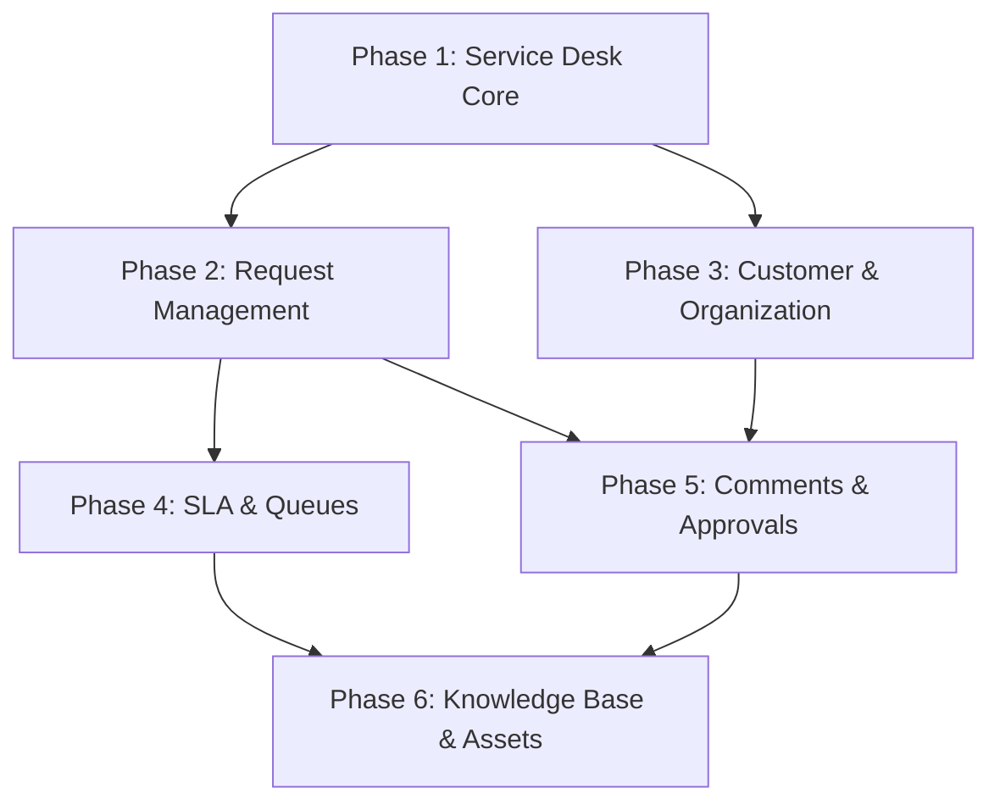

# JSM Implementation Orchestrator

## Overview

This document defines the orchestration strategy for implementing all JSM (Jira Service Management) features in parallel using Claude Code's Task tool and MCP coordination.

**Total Scope:** 6 Phases, 45 scripts implemented (44 planned + 1 bonus)
**Status:** ✅ COMPLETE
**Implementation Period:** December 2025
**Total Scripts:** 45/46 (get_jsm_info.py not implemented - low priority)
**Bonus Scripts:** create_service_desk.py (beyond original plan)

---

## Phase Dependency Graph



### Dependency Analysis

| Phase | Depends On | Can Start When |
|-------|------------|----------------|
| Phase 1 | None | Immediately |
| Phase 2 | Phase 1 (service desk discovery) | Phase 1.1-1.2 complete |
| Phase 3 | Phase 1 (service desk context) | Phase 1.1 complete |
| Phase 4 | Phase 2 (request context) | Phase 2.1-2.2 complete |
| Phase 5 | Phase 2, Phase 3 (request + customer context) | Phase 2.1 + Phase 3.1 complete |
| Phase 6 | Phase 4, Phase 5 (SLA + approval context) | Phase 4.1 + Phase 5.1 complete |

---

## Orchestration Strategy

### Wave 1: Foundation (Parallel Start) ✅ COMPLETE
```bash
# These can start immediately in parallel
Phase 1: Service Desk Core     [COMPLETE] 5/6 scripts (+ bonus: create_service_desk.py)
Phase 3: Customer & Organization (partial - org listing only) [COMPLETE]
```

### Wave 2: Core Operations (After Wave 1 milestones) ✅ COMPLETE
```bash
# Start when Phase 1.1-1.2 complete
Phase 2: Request Management    [COMPLETE] 5/5 scripts
Phase 3: Complete remaining    [COMPLETE] 13/13 scripts total
```

### Wave 3: Advanced Features (After Wave 2 milestones) ✅ COMPLETE
```bash
# Start when Phase 2.1-2.2 complete
Phase 4: SLA & Queues         [COMPLETE] 6/6 scripts
Phase 5: Comments & Approvals [COMPLETE] 6/6 scripts
```

### Wave 4: Enterprise Features (After Wave 3) ✅ COMPLETE
```bash
# Start when Phase 4.1 + Phase 5.1 complete
Phase 6: Knowledge Base & Assets [COMPLETE] 9/9 scripts
```

---

## MCP Coordination Commands

### Initialize Swarm
```javascript
// Initialize JSM implementation swarm
mcp__claude-flow__swarm_init({
  topology: "hierarchical",
  maxAgents: 6,
  strategy: "adaptive"
})

// Store implementation state
mcp__claude-flow__memory_usage({
  action: "store",
  namespace: "jsm-implementation",
  key: "status",
  value: JSON.stringify({
    wave: 1,
    phases: {
      phase1: "in_progress",
      phase2: "blocked",
      phase3: "partial",
      phase4: "blocked",
      phase5: "blocked",
      phase6: "blocked"
    },
    completedScripts: [],
    totalTests: 0
  })
})
```

### Spawn Implementation Agents (Wave 1)
```javascript
// Wave 1: Spawn foundation agents
[Parallel Agent Spawn via Task tool]:
  Task("Phase 1 Implementer", "Implement JSM Phase 1: Service Desk Core. Follow /docs/implementation-plans/jsm/JSM_PHASE1_SERVICE_DESK_CORE_IMPLEMENTATION_PLAN.md. Use TDD approach.", "coder")
  Task("Phase 3 Partial Implementer", "Implement JSM Phase 3.2 only: Organization listing. Follow /docs/implementation-plans/jsm/JSM_PHASE3_CUSTOMER_ORGANIZATION_IMPLEMENTATION_PLAN.md Phase 3.2.", "coder")
```

### Phase Completion Hooks
```bash
# Each agent should run after completing a phase milestone:
npx claude-flow@alpha hooks post-task --task-id "jsm-phase1-milestone"
npx claude-flow@alpha hooks notify --message "Phase 1 Service Desk Core complete. Unblocking Phase 2."

# Update memory to unblock next phases
mcp__claude-flow__memory_usage({
  action: "store",
  namespace: "jsm-implementation",
  key: "phase1/status",
  value: "complete"
})
```

---

## Parallel Execution Script

### orchestrate_jsm_implementation.py

```python
#!/usr/bin/env python3
"""
JSM Implementation Orchestrator

Coordinates parallel execution of JSM implementation phases using
Claude Code Task tool spawning with MCP memory coordination.

Usage:
    python orchestrate_jsm_implementation.py --wave 1
    python orchestrate_jsm_implementation.py --phase 2 --resume
    python orchestrate_jsm_implementation.py --status
"""

import argparse
import json
import subprocess
import sys
from pathlib import Path
from datetime import datetime

# Phase definitions with dependencies
PHASES = {
    1: {
        "name": "Service Desk Core",
        "plan": "JSM_PHASE1_SERVICE_DESK_CORE_IMPLEMENTATION_PLAN.md",
        "depends_on": [],
        "scripts": ["list_service_desks.py", "get_service_desk.py",
                   "list_request_types.py", "get_request_type.py",
                   "get_request_type_fields.py", "create_service_desk.py"],
        "status": "COMPLETE",
        "note": "get_jsm_info.py not implemented (low priority). create_service_desk.py added as bonus."
    },
    2: {
        "name": "Request Management",
        "plan": "JSM_PHASE2_REQUEST_MANAGEMENT_IMPLEMENTATION_PLAN.md",
        "depends_on": [1],
        "scripts": ["create_request.py", "get_request.py",
                   "transition_request.py", "list_requests.py",
                   "get_request_status.py"],
        "status": "COMPLETE"
    },
    3: {
        "name": "Customer & Organization",
        "plan": "JSM_PHASE3_CUSTOMER_ORGANIZATION_IMPLEMENTATION_PLAN.md",
        "depends_on": [1],
        "scripts": ["create_customer.py", "list_customers.py",
                   "add_customer.py", "remove_customer.py",
                   "create_organization.py", "list_organizations.py",
                   "get_organization.py", "delete_organization.py",
                   "add_to_organization.py", "remove_from_organization.py",
                   "get_participants.py", "add_participant.py",
                   "remove_participant.py"],
        "status": "COMPLETE"
    },
    4: {
        "name": "SLA & Queues",
        "plan": "JSM_PHASE4_SLA_QUEUE_IMPLEMENTATION_PLAN.md",
        "depends_on": [2],
        "scripts": ["get_sla.py", "check_sla_breach.py", "sla_report.py",
                   "list_queues.py", "get_queue.py", "get_queue_issues.py"],
        "status": "COMPLETE"
    },
    5: {
        "name": "Comments & Approvals",
        "plan": "JSM_PHASE5_COMMENTS_APPROVALS_IMPLEMENTATION_PLAN.md",
        "depends_on": [2, 3],
        "scripts": ["add_request_comment.py", "get_request_comments.py",
                   "get_approvals.py", "approve_request.py",
                   "decline_request.py", "list_pending_approvals.py"],
        "status": "COMPLETE"
    },
    6: {
        "name": "Knowledge Base & Assets",
        "plan": "JSM_PHASE6_KNOWLEDGE_ASSETS_IMPLEMENTATION_PLAN.md",
        "depends_on": [4, 5],
        "scripts": ["search_kb.py", "get_kb_article.py", "suggest_kb.py",
                   "list_assets.py", "get_asset.py", "create_asset.py",
                   "update_asset.py", "link_asset.py",
                   "find_affected_assets.py"],
        "status": "COMPLETE"
    }
}

WAVES = {
    1: [1, 3],  # Phase 1 + Phase 3 (partial)
    2: [2, 3],  # Phase 2 + Phase 3 (complete)
    3: [4, 5],  # Phase 4 + Phase 5
    4: [6]      # Phase 6
}


def get_phase_status():
    """Read current implementation status from memory."""
    # In real implementation, this would use MCP memory
    status_file = Path(__file__).parent / ".jsm_status.json"
    if status_file.exists():
        return json.loads(status_file.read_text())
    return {
        "wave": 0,
        "phases": {str(i): "pending" for i in range(1, 7)},
        "completed_scripts": [],
        "total_tests": 0,
        "started": None
    }


def save_phase_status(status):
    """Save implementation status to memory."""
    status_file = Path(__file__).parent / ".jsm_status.json"
    status_file.write_text(json.dumps(status, indent=2))


def check_dependencies(phase_num, status):
    """Check if phase dependencies are met."""
    deps = PHASES[phase_num]["depends_on"]
    for dep in deps:
        if status["phases"][str(dep)] != "complete":
            return False, f"Phase {dep} ({PHASES[dep]['name']}) not complete"
    return True, None


def get_runnable_phases(status):
    """Get phases that can be started based on dependencies."""
    runnable = []
    for phase_num in PHASES:
        if status["phases"][str(phase_num)] in ["pending", "blocked"]:
            can_run, _ = check_dependencies(phase_num, status)
            if can_run:
                runnable.append(phase_num)
    return runnable


def print_status(status):
    """Print current implementation status."""
    print("\n" + "=" * 60)
    print("JSM IMPLEMENTATION STATUS")
    print("=" * 60)

    total_scripts = sum(len(PHASES[p]["scripts"]) for p in PHASES)
    completed = len(status["completed_scripts"])

    print(f"\nOverall Progress: {completed}/{total_scripts} scripts")
    print(f"Total Tests: {status['total_tests']}")
    print(f"Current Wave: {status['wave']}")

    if status["started"]:
        print(f"Started: {status['started']}")

    print("\nPhase Status:")
    print("-" * 60)

    for phase_num, phase in PHASES.items():
        phase_status = status["phases"][str(phase_num)]
        deps_met, dep_msg = check_dependencies(phase_num, status)

        # Status emoji
        emoji = {
            "complete": "✅",
            "in_progress": "🔄",
            "pending": "⏳",
            "blocked": "🚫"
        }.get(phase_status, "❓")

        scripts_done = len([s for s in phase["scripts"]
                          if s in status["completed_scripts"]])

        print(f"{emoji} Phase {phase_num}: {phase['name']}")
        print(f"   Status: {phase_status}")
        print(f"   Scripts: {scripts_done}/{len(phase['scripts'])}")
        print(f"   Plan: {phase['plan']}")
        if not deps_met:
            print(f"   Blocked by: {dep_msg}")
        print()


def generate_agent_prompt(phase_num):
    """Generate the prompt for a phase implementation agent."""
    phase = PHASES[phase_num]
    return f"""
Implement JSM Phase {phase_num}: {phase['name']}

Follow the implementation plan at:
/docs/implementation-plans/jsm/{phase['plan']}

Use TDD approach:
1. Write failing tests first
2. Implement minimum code to pass tests
3. Refactor while keeping tests green

Scripts to implement:
{chr(10).join(f'- {s}' for s in phase['scripts'])}

After completing each script:
1. Run tests to verify: pytest tests/
2. Update the implementation plan checkboxes
3. Commit with message: feat(jira-jsm): implement {phase['scripts'][0].replace('.py', '')}

When phase is complete:
1. Run all phase tests
2. Update plan status to COMPLETE
3. Notify orchestrator via hooks
"""


def main():
    parser = argparse.ArgumentParser(description="JSM Implementation Orchestrator")
    parser.add_argument("--wave", type=int, help="Start a specific wave")
    parser.add_argument("--phase", type=int, help="Start a specific phase")
    parser.add_argument("--status", action="store_true", help="Show status")
    parser.add_argument("--resume", action="store_true", help="Resume from checkpoint")
    parser.add_argument("--reset", action="store_true", help="Reset all progress")

    args = parser.parse_args()

    status = get_phase_status()

    if args.reset:
        status = {
            "wave": 0,
            "phases": {str(i): "pending" for i in range(1, 7)},
            "completed_scripts": [],
            "total_tests": 0,
            "started": None
        }
        save_phase_status(status)
        print("Progress reset.")
        return

    if args.status:
        print_status(status)
        runnable = get_runnable_phases(status)
        if runnable:
            print(f"Ready to start: Phase(s) {', '.join(map(str, runnable))}")
        return

    if args.phase:
        can_run, msg = check_dependencies(args.phase, status)
        if not can_run:
            print(f"Cannot start Phase {args.phase}: {msg}")
            sys.exit(1)

        print(f"Starting Phase {args.phase}: {PHASES[args.phase]['name']}")
        print("\nAgent Prompt:")
        print("-" * 40)
        print(generate_agent_prompt(args.phase))

        status["phases"][str(args.phase)] = "in_progress"
        if not status["started"]:
            status["started"] = datetime.now().isoformat()
        save_phase_status(status)
        return

    if args.wave:
        if args.wave not in WAVES:
            print(f"Invalid wave: {args.wave}. Valid waves: 1-4")
            sys.exit(1)

        phases_in_wave = WAVES[args.wave]
        print(f"Starting Wave {args.wave}")
        print(f"Phases: {phases_in_wave}")

        for phase_num in phases_in_wave:
            can_run, msg = check_dependencies(phase_num, status)
            if can_run:
                print(f"\n--- Phase {phase_num}: {PHASES[phase_num]['name']} ---")
                print(generate_agent_prompt(phase_num))
                status["phases"][str(phase_num)] = "in_progress"
            else:
                print(f"\nSkipping Phase {phase_num}: {msg}")
                status["phases"][str(phase_num)] = "blocked"

        status["wave"] = args.wave
        if not status["started"]:
            status["started"] = datetime.now().isoformat()
        save_phase_status(status)
        return

    # Default: show status and suggestions
    print_status(status)
    print("\nUsage:")
    print("  --status        Show current progress")
    print("  --wave N        Start wave N (1-4)")
    print("  --phase N       Start specific phase")
    print("  --reset         Reset all progress")


if __name__ == "__main__":
    main()
```

---

## Claude Code Task Tool Integration

### Spawning Phase Agents

When ready to implement, use Claude Code's Task tool to spawn parallel agents:

```javascript
// Wave 1: Foundation
[Single Message - Parallel Agent Spawn]:
  Task("JSM Phase 1", "Implement JSM Phase 1 following JSM_PHASE1_SERVICE_DESK_CORE_IMPLEMENTATION_PLAN.md. TDD approach.", "coder")
  Task("JSM Phase 3 Orgs", "Implement JSM Phase 3.2 (Organizations) following JSM_PHASE3_CUSTOMER_ORGANIZATION_IMPLEMENTATION_PLAN.md Phase 3.2 only.", "coder")

  // Initialize memory
  mcp__claude-flow__memory_usage({action: "store", namespace: "jsm", key: "wave1/started", value: new Date().toISOString()})

// Wave 2: Core Operations (after Wave 1 complete)
[Single Message - Parallel Agent Spawn]:
  Task("JSM Phase 2", "Implement JSM Phase 2 following JSM_PHASE2_REQUEST_MANAGEMENT_IMPLEMENTATION_PLAN.md. TDD approach.", "coder")
  Task("JSM Phase 3 Complete", "Complete JSM Phase 3 remaining sections. TDD approach.", "coder")

// Wave 3: Advanced (after Wave 2 complete)
[Single Message - Parallel Agent Spawn]:
  Task("JSM Phase 4", "Implement JSM Phase 4 following JSM_PHASE4_SLA_QUEUE_IMPLEMENTATION_PLAN.md. TDD approach.", "coder")
  Task("JSM Phase 5", "Implement JSM Phase 5 following JSM_PHASE5_COMMENTS_APPROVALS_IMPLEMENTATION_PLAN.md. TDD approach.", "coder")

// Wave 4: Enterprise (after Wave 3 complete)
[Single Message]:
  Task("JSM Phase 6", "Implement JSM Phase 6 following JSM_PHASE6_KNOWLEDGE_ASSETS_IMPLEMENTATION_PLAN.md. TDD approach.", "coder")
```

---

## Progress Tracking

### Memory Keys for Coordination

```
jsm-implementation/
├── status                 # Overall status JSON
├── wave1/
│   ├── started           # Timestamp
│   ├── phase1/status     # pending|in_progress|complete
│   └── phase3/status     # Status for partial phase 3
├── wave2/
│   ├── started
│   ├── phase2/status
│   └── phase3/status     # Complete status
├── wave3/
│   ├── started
│   ├── phase4/status
│   └── phase5/status
├── wave4/
│   ├── started
│   └── phase6/status
├── scripts/              # Individual script completion
│   ├── list_service_desks/complete
│   ├── get_service_desk/complete
│   └── ...
└── tests/
    ├── total_count       # Running count of tests
    └── passing_count     # Tests passing
```

---

## Estimated Timeline

| Wave | Phases | Parallel Agents | Estimated Time |
|------|--------|-----------------|----------------|
| 1 | 1, 3 (partial) | 2 | 2-3 days |
| 2 | 2, 3 (complete) | 2 | 3-4 days |
| 3 | 4, 5 | 2 | 3-4 days |
| 4 | 6 | 1 | 2-3 days |

**Total with parallelization:** 10-14 days (vs 10-12 weeks sequential)

---

## Success Criteria

### Per Phase
- [x] All tests passing
- [x] Coverage ≥ 85%
- [x] SKILL.md documented
- [x] Integration tests added

### Overall
- [x] 45 scripts implemented (44 planned + 1 bonus)
- [x] 153+ live integration tests passing
- [x] jira-jsm skill complete
- [x] Integration with existing skills
- [x] GAP_ANALYSIS.md updated

## Implementation Summary

**Completion Date:** December 2025

### Scripts Implemented by Phase

| Phase | Scripts Implemented | Status |
|-------|---------------------|--------|
| Phase 1: Service Desk Core | 6/6 (5 planned + create_service_desk.py bonus) | ✅ COMPLETE |
| Phase 2: Request Management | 5/5 | ✅ COMPLETE |
| Phase 3: Customer & Organization | 13/13 | ✅ COMPLETE |
| Phase 4: SLA & Queues | 6/6 | ✅ COMPLETE |
| Phase 5: Comments & Approvals | 6/6 | ✅ COMPLETE |
| Phase 6: Knowledge Base & Assets | 9/9 | ✅ COMPLETE |
| **Total** | **45/46** | **✅ COMPLETE** |

### Notes
- **Not Implemented:** `get_jsm_info.py` (Phase 1) - Low priority informational script
- **Bonus Script:** `create_service_desk.py` (Phase 1) - Added beyond original plan
- **Live Integration Tests:** 153 comprehensive tests across all 7 skills
- **Test Coverage:** Session-scoped fixtures with automatic cleanup

---

## Quick Start

1. **Check Status:**
   ```bash
   python orchestrate_jsm_implementation.py --status
   ```

2. **Start Wave 1:**
   ```bash
   python orchestrate_jsm_implementation.py --wave 1
   ```
   Then spawn agents via Claude Code Task tool.

3. **Monitor Progress:**
   ```bash
   # Check memory status
   mcp__claude-flow__memory_usage({action: "retrieve", namespace: "jsm-implementation", key: "status"})
   ```

4. **Continue to Next Wave:**
   After Wave N complete, start Wave N+1.

---

**Document Version:** 2.0
**Created:** 2025-12-25
**Completed:** 2025-12-25
**Status:** ✅ IMPLEMENTATION COMPLETE
