# Architecture Diagram Options

## Overview
Architecture diagrams explain the system structure and help technical audiences understand how components interact. GitHub natively renders Mermaid diagrams, making them ideal for README files.

---

## 1. Progressive Disclosure Flow

### Option 3A: Simple Linear Flow
**Concept:** User → Claude → Skills → JIRA

```mermaid
flowchart LR
    A[👤 User] --> B[🤖 Claude Code]
    B --> C[📦 Skills]
    C --> D[🎫 JIRA API]
    D --> E[✅ Result]
    E --> A
```



**Pros:** Minimal, easy to understand
**Cons:** Doesn't show skill variety

### Option 3B: Skill Router Hub
**Concept:** Central router connecting to all skills

```mermaid
flowchart TD
    U[👤 User Request] --> CC[🤖 Claude Code]
    CC --> JA[📋 jira-assistant<br/>Meta-Router]

    JA --> |"Create bug"| JI[jira-issue]
    JA --> |"Start progress"| JL[jira-lifecycle]
    JA --> |"Find blockers"| JS[jira-search]
    JA --> |"Log time"| JT[jira-time]
    JA --> |"Start sprint"| JAG[jira-agile]
    JA --> |"Add comment"| JC[jira-collaborate]

    JI & JL & JS & JT & JAG & JC --> API[🔌 JIRA REST API]
    API --> JIRA[(☁️ JIRA Cloud)]
```



**Pros:** Shows routing logic, comprehensive
**Cons:** Complex, may overwhelm

### Option 3C: Layered Architecture
**Concept:** Horizontal layers showing abstraction

```mermaid
flowchart TB
    subgraph User["🎯 User Layer"]
        NL[Natural Language Request]
    end

    subgraph AI["🧠 AI Layer"]
        CC[Claude Code]
        SD[Skill Discovery]
    end

    subgraph Skills["📦 Skills Layer"]
        direction LR
        S1[Issue]
        S2[Lifecycle]
        S3[Search]
        S4[More...]
    end

    subgraph Shared["🔧 Shared Layer"]
        direction LR
        Client[JIRA Client]
        Config[Config Manager]
        Validators[Validators]
    end

    subgraph API["🔌 API Layer"]
        REST[JIRA REST API]
    end

    User --> AI --> Skills --> Shared --> API
```



**Pros:** Clear separation of concerns
**Cons:** Abstract, less engaging

### Option 3D: Request Journey
**Concept:** Show data transformation through system

```mermaid
sequenceDiagram
    participant U as 👤 User
    participant C as 🤖 Claude
    participant S as 📦 Skill
    participant A as 🔌 API
    participant J as ☁️ JIRA

    U->>C: "Create a high priority bug<br/>for login failing"
    Note over C: Understands intent,<br/>selects jira-issue skill
    C->>S: create_issue.py<br/>--type Bug --priority High
    S->>A: POST /rest/api/3/issue
    A->>J: Create Issue
    J-->>A: PROJ-456
    A-->>S: Issue Created
    S-->>C: Success + Details
    C-->>U: "Created PROJ-456:<br/>Login failing [High Priority Bug]"
```



**Pros:** Shows real interaction, step-by-step
**Cons:** Long, specific to one use case

---

## 2. Skill Relationship Diagrams

### Option 3E: Skill Categories
**Concept:** Group skills by function


**Pros:** Shows skill organization
**Cons:** Mindmaps render differently across platforms

### Option 3F: Skill Dependency Graph
**Concept:** Show what each skill depends on


**Pros:** Shows architecture, emphasizes shared code
**Cons:** Doesn't show user-facing value

### Option 3G: Feature Matrix
**Concept:** Capabilities organized by area

```mermaid
flowchart LR
    subgraph CRUD["📝 Issue CRUD"]
        create[Create]
        read[Read]
        update[Update]
        delete[Delete]
    end

    subgraph Workflow["🔄 Workflow"]
        transition[Transition]
        assign[Assign]
        resolve[Resolve]
    end

    subgraph Discovery["🔍 Discovery"]
        search[Search]
        filter[Filter]
        export[Export]
    end

    subgraph Agile["🏃 Agile"]
        sprint[Sprints]
        epic[Epics]
        board[Boards]
    end
```



**Pros:** Feature-focused, scannable
**Cons:** Doesn't show integration

---

## 3. Data Flow Diagrams

### Option 3H: Configuration Flow
**Concept:** Show config priority and merging

```mermaid
flowchart TD
    ENV[🔐 Environment Variables<br/>JIRA_API_TOKEN, etc.] --> |Priority 1| MERGE
    LOCAL[📁 settings.local.json<br/>Personal credentials] --> |Priority 2| MERGE
    TEAM[📁 settings.json<br/>Team defaults] --> |Priority 3| MERGE
    DEFAULT[⚙️ Hardcoded Defaults<br/>Fallback values] --> |Priority 4| MERGE

    MERGE[Config Manager] --> CLIENT[JIRA Client]
    CLIENT --> API[JIRA API Calls]
```



**Pros:** Explains config system clearly
**Cons:** Internal detail, less user-focused

### Option 3I: Error Handling Flow
**Concept:** Show 4-layer error handling

```mermaid
flowchart TD
    INPUT[User Input] --> VAL{Validators}
    VAL --> |Invalid| FAIL1[❌ Fast Fail<br/>Clear message]
    VAL --> |Valid| API[API Call]

    API --> |Success| OK[✅ Success]
    API --> |Error| HANDLER{Error Handler}

    HANDLER --> |401| AUTH[🔑 Auth Error<br/>Check token URL]
    HANDLER --> |429/5xx| RETRY{Retry Logic}
    HANDLER --> |Other| USER[📋 User Message<br/>Troubleshooting hints]

    RETRY --> |Max 3| API
    RETRY --> |Exhausted| TIMEOUT[⏱️ Timeout]
```



**Pros:** Shows robustness
**Cons:** Technical, developer-focused

### Option 3J: Multi-Profile Architecture
**Concept:** Show profile-based multi-instance support

```mermaid
flowchart LR
    subgraph Profiles["🔧 Profiles"]
        DEV[Development]
        STAGING[Staging]
        PROD[Production]
    end

    subgraph Instances["☁️ JIRA Instances"]
        DEV --> DEV_JIRA[dev.atlassian.net]
        STAGING --> STG_JIRA[staging.atlassian.net]
        PROD --> PROD_JIRA[company.atlassian.net]
    end

    USER[User] --> |--profile dev| Profiles
```



**Pros:** Shows enterprise feature
**Cons:** Niche use case

---

## 4. API Architecture

### Option 3K: REST API Mapping
**Concept:** Show which APIs each skill uses


**Pros:** Technical accuracy
**Cons:** Only relevant to contributors

### Option 3L: Complete System Overview
**Concept:** Everything in one diagram

```mermaid
flowchart TB
    subgraph Interface["💬 Interface"]
        CLI[Claude Code CLI]
        IDE[VS Code / IDE]
    end

    subgraph Intelligence["🧠 AI Processing"]
        LLM[Claude LLM]
        CONTEXT[Skill Context]
        ROUTING[Intent Routing]
    end

    subgraph SkillLayer["📦 14 JIRA Skills"]
        direction LR
        CORE[Core<br/>issue, lifecycle, search]
        COLLAB[Collab<br/>collaborate, relationships]
        AGILE_S[Agile<br/>agile, time]
        ENT[Enterprise<br/>jsm, bulk]
        DEV_S[DevOps<br/>dev, fields, ops]
        META[Meta<br/>assistant, admin]
    end

    subgraph Shared_Lib["🔧 Shared Library"]
        direction LR
        CLIENT[JIRA Client<br/>Retry, Session]
        CONFIG[Config<br/>Multi-profile]
        TOOLS[Validators<br/>Formatters]
    end

    subgraph External["☁️ External"]
        JIRA_CLOUD[JIRA Cloud]
        JIRA_DC[JIRA Data Center]
    end

    Interface --> Intelligence
    Intelligence --> SkillLayer
    SkillLayer --> Shared_Lib
    Shared_Lib --> External
```



**Pros:** Comprehensive, impressive
**Cons:** Complex, may not render well on mobile

---

## 5. Alternative Formats

### Option 3M: ASCII Art (No Dependencies)
**Concept:** Works everywhere, no rendering required

```
┌─────────────────────────────────────────────────────────────┐
│                     JIRA Assistant Skills                    │
├─────────────────────────────────────────────────────────────┤
│                                                              │
│   ┌──────────┐    ┌──────────────┐    ┌──────────────────┐  │
│   │   User   │───▶│  Claude Code │───▶│   14 Skills      │  │
│   │ Request  │    │  (AI Layer)  │    │  (Python/CLI)    │  │
│   └──────────┘    └──────────────┘    └────────┬─────────┘  │
│                                                 │            │
│                                                 ▼            │
│                                        ┌──────────────────┐  │
│                                        │  Shared Library  │  │
│                                        │  (Client/Config) │  │
│                                        └────────┬─────────┘  │
│                                                 │            │
│                                                 ▼            │
│                                        ┌──────────────────┐  │
│                                        │   JIRA Cloud     │  │
│                                        │   REST API       │  │
│                                        └──────────────────┘  │
│                                                              │
└─────────────────────────────────────────────────────────────┘
```

**Pros:** Universal compatibility, no render issues
**Cons:** Limited detail, looks dated

### Option 3N: Table-Based Architecture
**Concept:** Use tables for structure

| Layer | Component | Purpose |
|-------|-----------|---------|
| 🎯 User | Natural Language | Ask questions, give commands |
| 🧠 AI | Claude Code | Understand intent, select skill |
| 📦 Skills | 14 Specialized | Execute specific JIRA operations |
| 🔧 Shared | Client, Config | Common functionality |
| ☁️ API | JIRA REST | Cloud or Data Center |

**Pros:** Simple, mobile-friendly
**Cons:** Less visual impact

---

## Recommendation

**For README hero/architecture section:**
1. **Primary:** Option 3B (Skill Router Hub) - Shows value and variety
2. **Secondary:** Option 3D (Request Journey) - Demonstrates real usage

**For technical documentation:**
1. Option 3C (Layered Architecture) - Clean separation
2. Option 3H (Configuration Flow) - Config explanation

**For contributor docs:**
1. Option 3F (Skill Dependency) - Code structure
2. Option 3K (REST API Mapping) - API reference

---

## Implementation Notes

- Mermaid diagrams render natively on GitHub
- Test diagrams at [mermaid.live](https://mermaid.live)
- Keep diagrams under 20 nodes for mobile readability
- Use consistent emoji for visual grouping
- Consider dark/light theme compatibility
