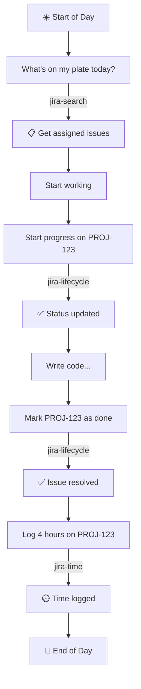
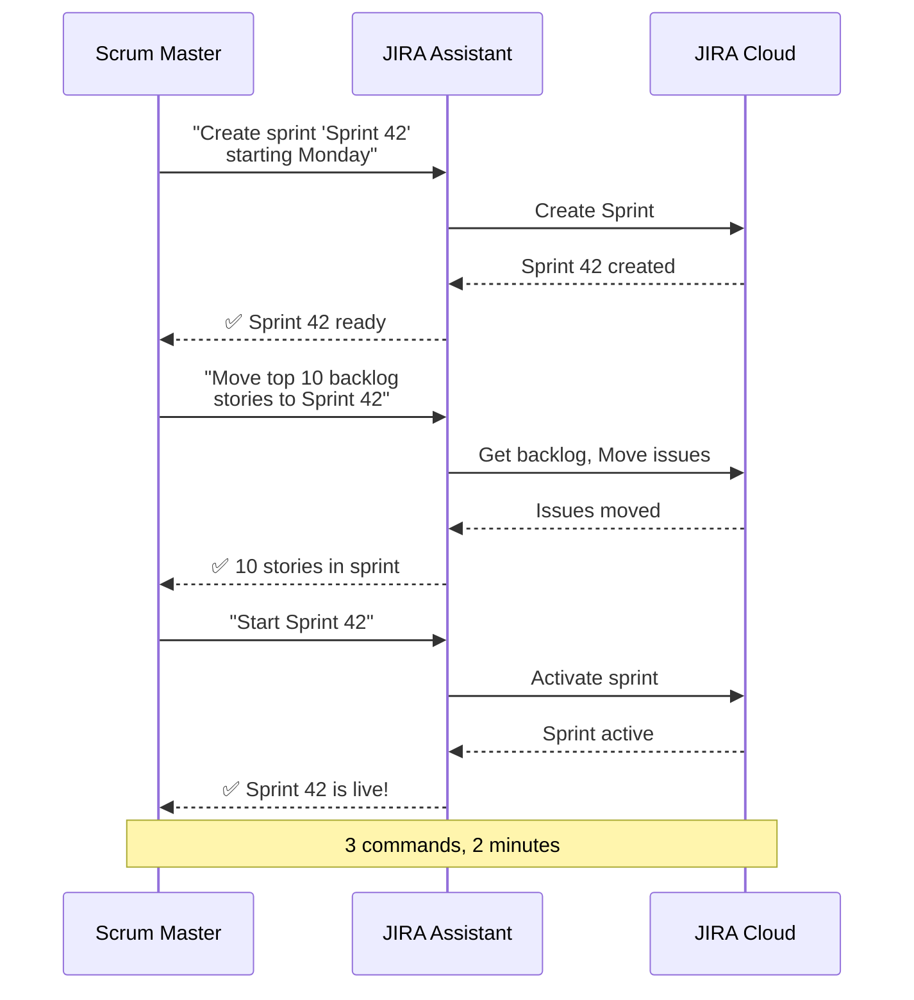
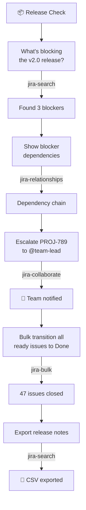
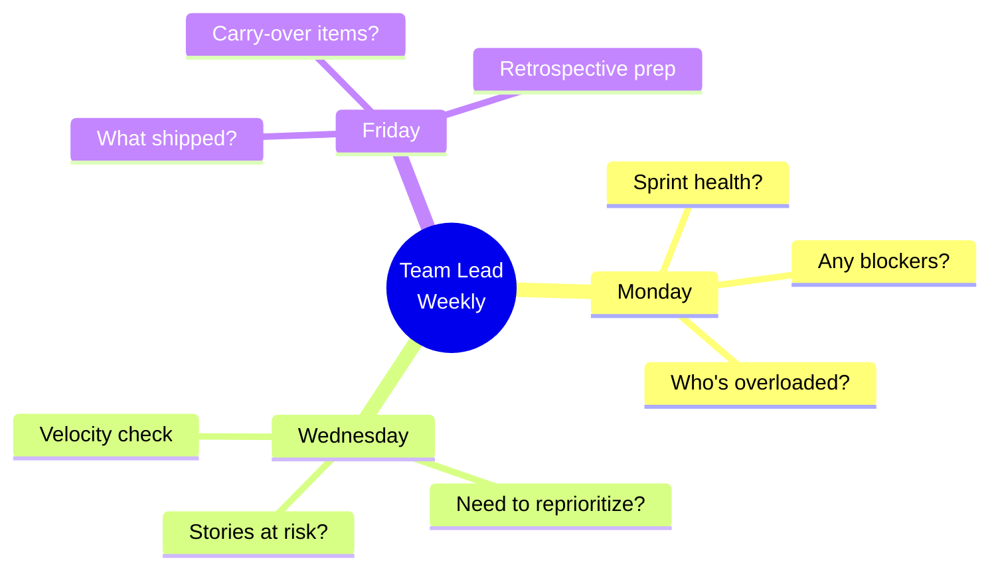
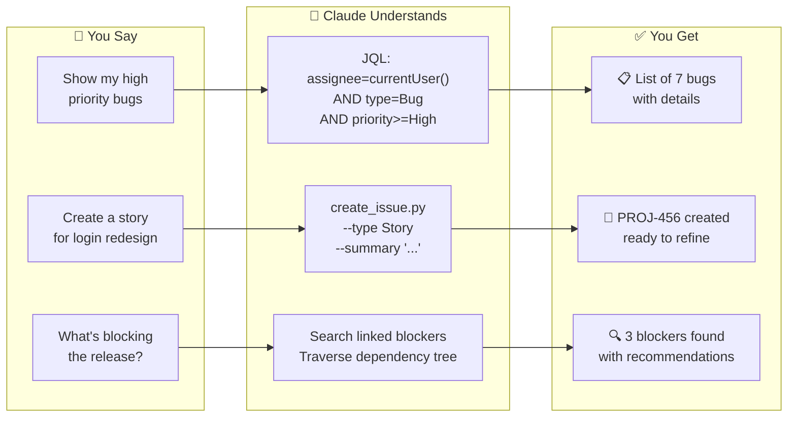
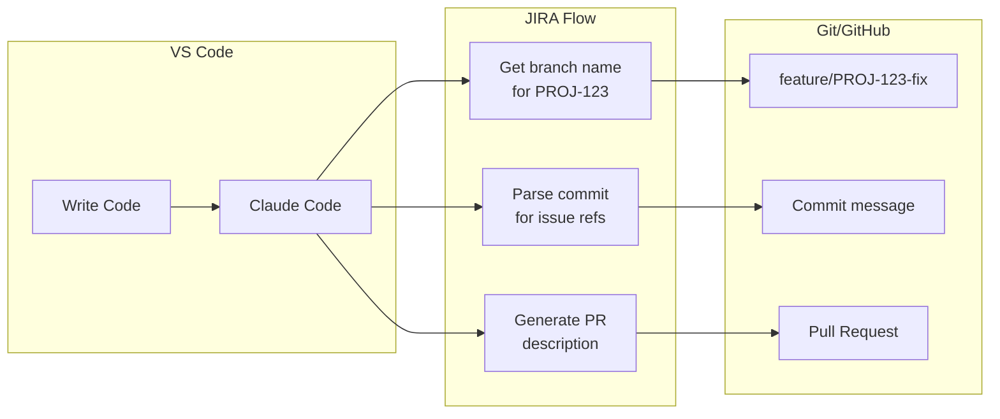
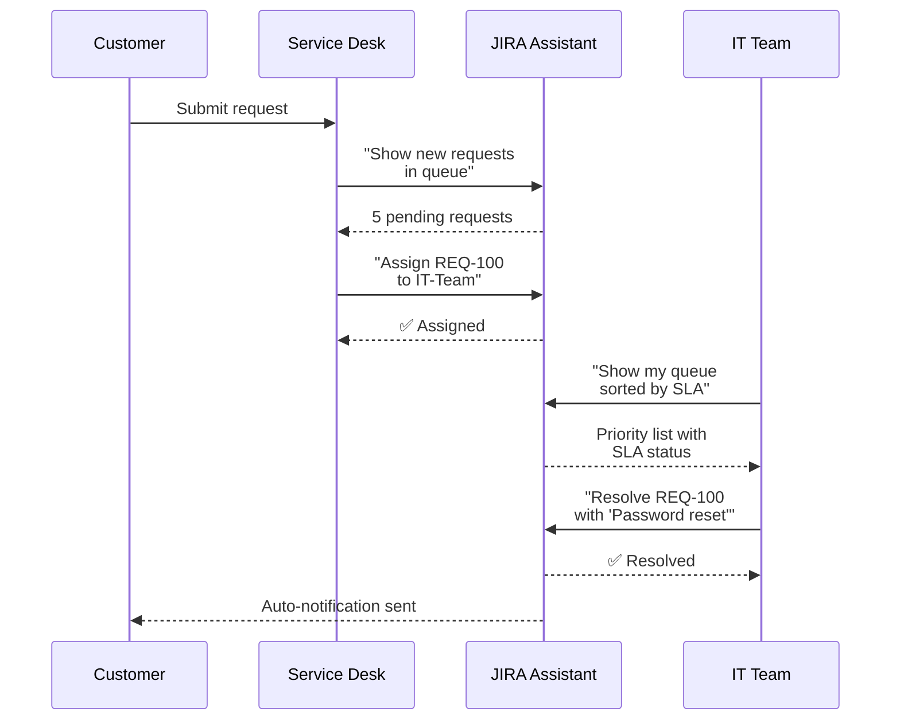
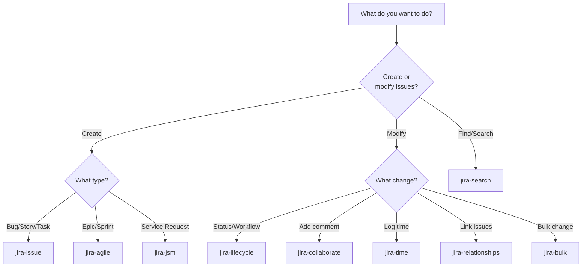

# Use Case Visualizations

## Overview
Use case visualizations demonstrate real-world scenarios where JIRA Assistant Skills solve problems. They help potential users see themselves using the tool.

---

## 1. Workflow Diagrams

### Option 4A: Developer Daily Workflow
**Concept:** Show a developer's typical day with JIRA Assistant



### Option 4B: Sprint Planning Workflow
**Concept:** Scrum Master's sprint planning session



### Option 4C: Incident Response Flow
**Concept:** IT/Ops handling a production incident

```mermaid
flowchart LR
    ALERT[🚨 Alert!] --> CREATE["Create urgent bug:<br/>'Production down'"]
    CREATE --> |jira-issue| BUG[INCIDENT-999]

    BUG --> ASSIGN["Assign to on-call"]
    ASSIGN --> |jira-lifecycle| ASSIGNED[👤 Assigned]

    ASSIGNED --> INVESTIGATE[Investigate...]
    INVESTIGATE --> LINK["Link to root cause<br/>INFRA-456"]
    LINK --> |jira-relationships| LINKED[🔗 Linked]

    LINKED --> FIX[Apply fix...]
    FIX --> RESOLVE["Resolve with<br/>'Hotfix deployed'"]
    RESOLVE --> |jira-lifecycle| DONE[✅ Resolved]

    DONE --> POSTMORTEM["Create follow-up<br/>task for postmortem"]
    POSTMORTEM --> |jira-issue| TASK[INCIDENT-1000]
```



### Option 4D: Release Preparation
**Concept:** Release manager checking readiness



---

## 2. Role-Based Scenarios

### Option 4E: Developer Journey Map
**Concept:** Visual timeline of developer interactions

```
┌─────────────────────────────────────────────────────────────────────────┐
│                        DEVELOPER DAY WITH JIRA ASSISTANT                 │
├─────────────────────────────────────────────────────────────────────────┤
│                                                                          │
│  9:00 AM          10:30 AM         2:00 PM          4:30 PM    5:00 PM  │
│     │                │                │                │          │      │
│     ▼                ▼                ▼                ▼          ▼      │
│  ┌──────┐        ┌──────┐        ┌──────┐        ┌──────┐    ┌──────┐   │
│  │What's│        │Create│        │Start │        │ Log  │    │What  │   │
│  │my    │        │spike │        │prog  │        │ 3hrs │    │did I │   │
│  │work? │        │ticket│        │PROJ- │        │ on   │    │finish│   │
│  │      │        │      │        │ 456  │        │PROJ- │    │today?│   │
│  └──┬───┘        └──┬───┘        └──┬───┘        │ 456  │    └──┬───┘   │
│     │               │               │            └──┬───┘       │       │
│     ▼               ▼               ▼               ▼           ▼       │
│  jira-search    jira-issue    jira-lifecycle    jira-time   jira-search │
│                                                                          │
│  [5 issues]     [PROJ-789]    [In Progress]     [Logged]    [3 done]    │
└─────────────────────────────────────────────────────────────────────────┘
```

### Option 4F: Team Lead Dashboard View
**Concept:** What a team lead asks throughout the week



### Option 4G: Product Manager Queries
**Concept:** PM's information needs

| Time | Question | Skill | Result |
|------|----------|-------|--------|
| Planning | "Show all stories without estimates" | jira-search | Refinement list |
| Prioritization | "Move FEAT-123 to top of backlog" | jira-agile | Backlog reordered |
| Stakeholder | "What shipped in v2.1?" | jira-search | Release notes |
| Roadmap | "Create epic for Q2 initiative" | jira-agile | Epic created |
| Metrics | "How many bugs closed this month?" | jira-search | Count + export |

---

## 3. Capability Showcase

### Option 4H: Feature Grid
**Concept:** Visual matrix of what's possible

```
┌────────────────────────────────────────────────────────────────────────┐
│                    WHAT CAN YOU DO WITH JIRA ASSISTANT?                 │
├────────────────────────────────────────────────────────────────────────┤
│                                                                         │
│  ┌─────────────┐  ┌─────────────┐  ┌─────────────┐  ┌─────────────┐   │
│  │   CREATE    │  │   SEARCH    │  │   UPDATE    │  │   ANALYZE   │   │
│  ├─────────────┤  ├─────────────┤  ├─────────────┤  ├─────────────┤   │
│  │ Bugs        │  │ By JQL      │  │ Status      │  │ Blockers    │   │
│  │ Stories     │  │ By filter   │  │ Assignee    │  │ Dependencies│   │
│  │ Tasks       │  │ Natural     │  │ Priority    │  │ Time spent  │   │
│  │ Epics       │  │ language    │  │ Sprint      │  │ Velocity    │   │
│  │ Subtasks    │  │             │  │ Labels      │  │ Workload    │   │
│  └─────────────┘  └─────────────┘  └─────────────┘  └─────────────┘   │
│                                                                         │
│  ┌─────────────┐  ┌─────────────┐  ┌─────────────┐  ┌─────────────┐   │
│  │    LINK     │  │    TIME     │  │    BULK     │  │   EXPORT    │   │
│  ├─────────────┤  ├─────────────┤  ├─────────────┤  ├─────────────┤   │
│  │ Blocks      │  │ Log work    │  │ Transitions │  │ CSV         │   │
│  │ Relates     │  │ Estimates   │  │ Assignments │  │ JSON        │   │
│  │ Duplicates  │  │ Reports     │  │ Priorities  │  │ Formatted   │   │
│  │ Clones      │  │ Timesheet   │  │ Clone sets  │  │ tables      │   │
│  └─────────────┘  └─────────────┘  └─────────────┘  └─────────────┘   │
│                                                                         │
└────────────────────────────────────────────────────────────────────────┘
```

### Option 4I: Command → Result Flow
**Concept:** Show transformation from natural language to outcome



---

## 4. Problem-Solution Stories

### Option 4J: Before/After Narrative
**Concept:** Story format showing transformation

```
┌─────────────────────────────────────────────────────────────────────────┐
│ THE MONDAY MORNING STANDUP PROBLEM                                       │
├─────────────────────────────────────────────────────────────────────────┤
│                                                                          │
│ BEFORE: Sarah's Monday Routine (15 minutes)                              │
│ ─────────────────────────────────────────────                            │
│ 1. Open JIRA                                                  2 min      │
│ 2. Navigate to board                                          1 min      │
│ 3. Filter by assignee (can never remember how)                3 min      │
│ 4. Check each issue status                                    5 min      │
│ 5. Look up sprint velocity (where is that again?)             2 min      │
│ 6. Copy issues to notes for standup                           2 min      │
│                                                                          │
│ AFTER: Sarah's Monday with JIRA Assistant (45 seconds)                   │
│ ──────────────────────────────────────────────────────                   │
│ Sarah: "What's my sprint work and yesterday's progress?"                 │
│                                                                          │
│ Claude: Here's your Sprint 42 status:                                    │
│         • In Progress: PROJ-123, PROJ-124                                │
│         • Completed yesterday: PROJ-120, PROJ-121                        │
│         • Remaining: 13 story points                                     │
│         • Sprint velocity: on track                                      │
│                                                                          │
│ TIME SAVED: 14 minutes per standup × 50 standups/year = 12 hours/year   │
└─────────────────────────────────────────────────────────────────────────┘
```

### Option 4K: Pain Point Resolution
**Concept:** Map common frustrations to solutions

| Pain Point | Old Way | New Way | Skill |
|------------|---------|---------|-------|
| "JQL is confusing" | Google syntax, trial & error | "Show bugs from last week" | jira-search |
| "Status updates are tedious" | Click, click, click, click | "Move PROJ-123 to Done" | jira-lifecycle |
| "Sprint setup takes forever" | Manual drag & drop | "Create sprint with top 10 stories" | jira-agile |
| "Time logging forgotten" | End-of-week scramble | "Log 2 hours on PROJ-123" | jira-time |
| "Blockers hidden" | Manual dependency check | "What's blocking the release?" | jira-relationships |

---

## 5. Integration Scenarios

### Option 4L: Development Pipeline
**Concept:** Show integration with developer tools



### Option 4M: Service Desk Workflow
**Concept:** IT support ticket handling



---

## 6. Decision Flowcharts

### Option 4N: "Which Skill Do I Need?"
**Concept:** Help users find the right skill



---

## Recommendation

**For README:**
1. **Primary:** Option 4I (Command → Result Flow) - Shows value quickly
2. **Secondary:** Option 4J (Before/After Narrative) - Emotional resonance

**For Documentation:**
1. Option 4A-4D (Workflow Diagrams) - Per-role sections
2. Option 4N (Decision Flowchart) - Skill selection guide

**For Marketing:**
1. Option 4K (Pain Point Resolution) - Feature comparison
2. Option 4E (Developer Journey Map) - Day-in-the-life story
