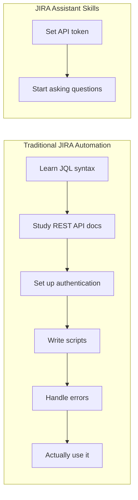

# Comparison Content Options

## Overview
Comparison content helps users understand the value proposition by contrasting JIRA Assistant Skills with alternatives. Effective comparisons are honest, specific, and focus on user outcomes.

---

## 1. Before/After Comparisons

### Option 5A: Side-by-Side Code Blocks
**Concept:** Show the same task two ways

```markdown
<table>
<tr>
<td width="50%">

### ❌ The JQL Way
```jql
project = PROJ AND
status IN ("To Do", "In Progress") AND
assignee = currentUser() AND
sprint IN openSprints() AND
priority IN (High, Highest)
ORDER BY priority DESC, created ASC
```
*Hope you remembered the syntax...*

</td>
<td width="50%">

### ✅ The Natural Way
```
"Show my high priority sprint work"
```
*Just ask.*

</td>
</tr>
</table>
```

**Pros:** Dramatic visual contrast, scannable
**Cons:** May seem to mock JQL (which power users love)

### Option 5B: Task Completion Timeline
**Concept:** Time comparison for common tasks

| Task | Traditional JIRA | JIRA Assistant | Time Saved |
|------|------------------|----------------|------------|
| Find my open bugs | 45 seconds | 5 seconds | 89% |
| Create sprint + add stories | 3 minutes | 15 seconds | 92% |
| Log time on 5 issues | 2 minutes | 20 seconds | 83% |
| Check what's blocking release | 5 minutes | 10 seconds | 97% |
| Bulk close 20 resolved issues | 4 minutes | 30 seconds | 88% |

**Pros:** Quantifiable, impressive numbers
**Cons:** Times are estimates, may seem exaggerated

### Option 5C: Click Count Comparison
**Concept:** Count UI interactions

```
┌─────────────────────────────────────────────────────────────────────────┐
│ CREATING A BUG REPORT                                                    │
├─────────────────────────────────────────────────────────────────────────┤
│                                                                          │
│ JIRA WEB UI                          JIRA ASSISTANT                      │
│ ──────────────────                   ─────────────────                   │
│ 1. Click "Create"                    1. Type: "Create high priority      │
│ 2. Select project                       bug: Login fails with            │
│ 3. Select issue type                    error 500 on Safari"             │
│ 4. Type summary                                                          │
│ 5. Type description                  DONE ✅                             │
│ 6. Set priority                                                          │
│ 7. Set components                    1 command                           │
│ 8. Set labels                        0 clicks                            │
│ 9. Click "Create"                    ~5 seconds                          │
│                                                                          │
│ 9 clicks + typing                                                        │
│ ~45 seconds                                                              │
│                                                                          │
└─────────────────────────────────────────────────────────────────────────┘
```

**Pros:** Concrete, relatable
**Cons:** Oversimplifies (some fields may still be needed)

---

## 2. Feature Comparison Tables

### Option 5D: Method Comparison Matrix
**Concept:** Compare with other automation approaches

| Feature | JIRA Web UI | JIRA API Direct | MCP Server | **JIRA Assistant Skills** |
|---------|-------------|-----------------|------------|---------------------------|
| Natural language | ❌ | ❌ | ⚠️ Limited | ✅ Full |
| No JQL required | ❌ | ❌ | ⚠️ Some | ✅ Complete |
| Setup time | 0 | Hours | 30 min | 5 min |
| Learning curve | Medium | High | Medium | Low |
| Context efficiency | N/A | N/A | 20K tokens | 2K tokens |
| Offline docs | ❌ | ❌ | ❌ | ✅ Built-in |
| Multi-instance | ⚠️ Manual | ✅ | ⚠️ | ✅ Profiles |
| Bulk operations | ⚠️ Slow | ✅ | ⚠️ | ✅ Optimized |
| Error handling | Browser errors | Raw HTTP | Generic | Contextual help |

**Pros:** Comprehensive, fair comparison
**Cons:** Long, may overwhelm casual readers

### Option 5E: Use Case Fit Matrix
**Concept:** Which solution fits which need

| Use Case | Best Solution | Why |
|----------|--------------|-----|
| Quick status check | **JIRA Assistant** | Natural language, instant |
| Complex dashboard | JIRA Web UI | Visual, interactive |
| One-off API call | API Direct | No overhead |
| Repetitive tasks | **JIRA Assistant** | Conversational automation |
| Building integrations | API Direct | Full control |
| Non-technical users | **JIRA Assistant** | No training needed |
| Bulk data migration | API Direct | Performance |
| Daily workflow | **JIRA Assistant** | Convenience |

**Pros:** Honest, helps users choose right tool
**Cons:** Admits limitations

### Option 5F: Skill vs MCP Comparison
**Concept:** Specific comparison with MCP servers

```markdown
| Aspect | MCP Server Approach | Claude Code Skills |
|--------|--------------------|--------------------|
| **Architecture** | Tool-per-API-call | Skill-per-workflow |
| **Context tokens** | ~20,000 per query | ~2,000 per query |
| **Conversation flow** | Stateless tools | Stateful context |
| **Error messages** | Generic API errors | Troubleshooting hints |
| **Validation** | At API call time | Before API call |
| **Documentation** | External reference | Built into skill |
| **Multi-step tasks** | Multiple tool calls | Single skill invocation |
| **Offline capability** | Requires server | Fully local |
```

**Pros:** Addresses specific alternative, technical accuracy
**Cons:** Niche audience (those evaluating MCP)

---

## 3. Journey Comparisons

### Option 5G: New User Onboarding
**Concept:** Compare getting started experience



**Pros:** Shows dramatic simplification
**Cons:** Oversimplifies traditional approach

### Option 5H: Learning Curve Visualization
**Concept:** Graph showing time to productivity

```
Productivity
    ^
    │                                    ┌─────────────────
    │                                   /  Skills
    │                                  /
    │         ┌───────────────────────/
    │        /        Traditional
    │       /
    │      /
    │     /
    │    /
    │   /
    │──/─────────────────────────────────────────────────> Time
    │
    Day 1        Week 1        Month 1        Month 3
```

**Pros:** Visual, intuitive meaning
**Cons:** Arbitrary curve shapes

---

## 4. Specific Feature Comparisons

### Option 5I: Search Comparison
**Concept:** Finding issues - three ways

```markdown
### Finding all high-priority bugs assigned to you in the current sprint

**Option A: JIRA UI**
1. Go to board
2. Open filters panel
3. Select "Assignee: Current User"
4. Select "Type: Bug"
5. Select "Priority: High, Highest"
6. Ensure sprint filter is active
7. Sort by priority

**Option B: Raw JQL**
```jql
project = PROJ AND assignee = currentUser() AND type = Bug AND priority IN (High, Highest) AND sprint IN openSprints() ORDER BY priority DESC
```

**Option C: JIRA Assistant**
```
"Show my high priority sprint bugs"
```
```

### Option 5J: Bulk Operations Comparison
**Concept:** Mass updates

```markdown
### Closing 50 resolved issues

**JIRA UI:**
- Open search
- Select issues (max 50 at a time)
- Bulk change → Transition → Done
- Confirm → Wait → Repeat if needed
- **Time: 3-5 minutes**

**API Script:**
```python
for issue in issues:
    requests.post(f'/issue/{issue}/transitions', ...)
# Plus error handling, rate limiting, etc.
```
- **Time: 30 minutes to write, 10 seconds to run**

**JIRA Assistant:**
```
"Close all resolved issues in PROJ from this sprint"
```
- **Time: 10 seconds**
```

---

## 5. Competitor Positioning

### Option 5K: Market Position Map
**Concept:** 2x2 positioning matrix

```
                    High Automation
                          ^
                          │
           ┌──────────────┼──────────────┐
           │              │              │
           │   Zapier/    │  JIRA        │
           │   Automation │  Assistant   │
           │   Rules      │  Skills      │
           │              │     ★        │
Low ───────┼──────────────┼──────────────┼─────── High
Flexibility│              │              │        Flexibility
           │   JIRA       │   Custom     │
           │   Web UI     │   Scripts    │
           │              │              │
           │              │              │
           └──────────────┼──────────────┘
                          │
                    Low Automation
```

**Pros:** Strategic positioning, memorable
**Cons:** Subjective placement

### Option 5L: Decision Helper
**Concept:** Help users choose the right tool

```markdown
## Choose Your Approach

**Use JIRA Web UI when:**
- You need visual dashboards
- You're doing one-off tasks
- You prefer clicking over typing

**Use JIRA API directly when:**
- Building permanent integrations
- Performance is critical
- You need maximum control

**Use JIRA Assistant Skills when:**
- You want conversational interaction
- You do repetitive JIRA tasks
- You don't want to learn JQL
- You value quick results over perfect control
```

**Pros:** Helpful, honest, builds trust
**Cons:** Admits tool isn't for everyone

---

## 6. Testimonial-Style Comparisons

### Option 5M: Quote Format
**Concept:** Fictional but relatable quotes

```markdown
> "I used to spend 10 minutes every morning checking my JIRA board. Now I just ask Claude what's on my plate."
> — Developer persona

> "Writing JQL was always hit-or-miss. Now I just describe what I want in plain English."
> — Team Lead persona

> "We reduced our sprint planning prep from 2 hours to 20 minutes."
> — Scrum Master persona
```

**Pros:** Relatable, emotional appeal
**Cons:** Fictional quotes may seem inauthentic

### Option 5N: Story Format
**Concept:** Narrative comparison

```markdown
## Sarah's Story

**Before JIRA Assistant:**
Sarah dreaded Monday standups. Every week, she'd spend 15 minutes clicking through JIRA, trying to remember the right filters, copying issue keys to her notes. By the time standup started, she was already frustrated.

**After JIRA Assistant:**
Now Sarah just asks: "What did I complete last week and what's in my current sprint?" In 10 seconds, she has everything she needs. She's actually early to standups now.

**The difference:** 14 minutes saved daily × 250 work days = **58 hours per year**
```

**Pros:** Emotional connection, specific savings
**Cons:** Long format, may not be read

---

## Recommendation

**For README (immediate impact):**
1. **Primary:** Option 5A (Side-by-Side Code) - Visual, scannable
2. **Secondary:** Option 5B (Time Table) - Quantifiable value

**For Documentation:**
1. Option 5D (Feature Matrix) - Comprehensive reference
2. Option 5L (Decision Helper) - Honest guidance

**For Marketing Materials:**
1. Option 5C (Click Count) - Concrete visualization
2. Option 5K (Position Map) - Strategic positioning

**Avoid:**
- Fictional quotes without real users
- Exaggerated time savings claims
- Direct competitor bashing
